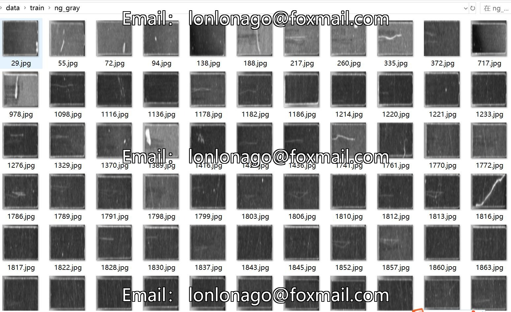
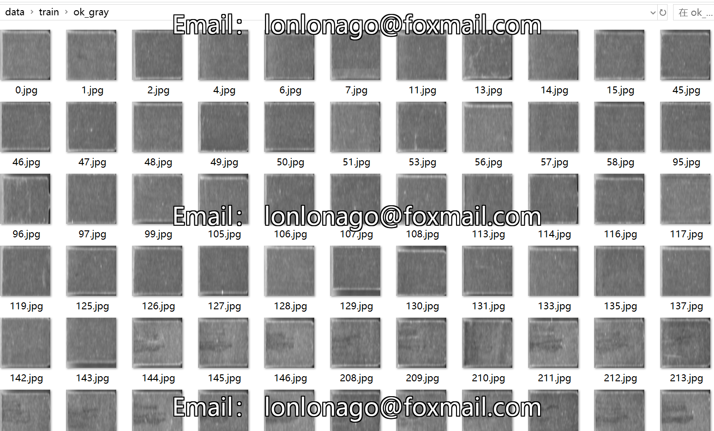

# Copper Sheet Scratch Identification Classification Dataset: 1557 Images in 3 Classes at Low Resolution

Dataset Type: Image classification for use, not for object detection without labeled files.
Dataset Format: Only contains jpg images, each category folder contains the corresponding image.
Number of Images (Number of jpg files): 1557
Image Resolution: 224x224
Number of Categories: 3
Category Names: ['ng_gray', 'ok_gray', 'unk_gray']
Number of Images per Category:
Training set images: 1245
- ng_gray Training set images: 225
- ok_gray Training set images: 588
- unk_gray Training set images: 432
Validation set images: 312
- ng_gray Validation set images: 57
- ok_gray Validation set images: 147
- unk_gray Validation set images: 108
Testing set images: 0
Total Images Count:
- ng_gray Total Images Count: 282
- ok_gray Total Images Count: 735
- unk_gray Total Images Count: 540
Important Notes: None
Special Declaration: This dataset does not guarantee the accuracy of the trained models or weight files.
Image Preview:

## Images

Here is a pay link on Stripe ( https://buy.stripe.com/3cs8yP7sY87d0vu9AB ). Please contact me lonlonago@foxmail.com after funding $89, and I will send you a complete data files , thank you!

